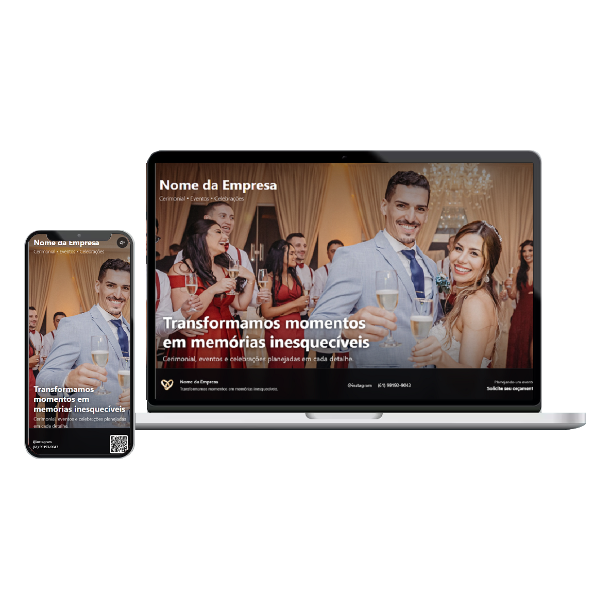

<p align="center"></p>


# Apresentação para Cerimonial e Eventos

Modelo de apresentação automática de fotos, vídeos e informações institucionais para exibição em eventos. O projeto foi pensado para funcionar continuamente em **totens, TVs, monitores e painéis**, apresentando o conteúdo em tela cheia sem exigir navegação constante do público.

A playlist alterna automaticamente entre imagens e vídeos, exibe títulos e descrições, mostra o progresso de cada mídia e reinicia ao chegar ao final. O layout é responsivo e se adapta a telas horizontais e verticais.

## Funcionalidades

- Reprodução automática e contínua da playlist;
- suporte a imagens e vídeos MP4;
- tempo de exibição configurável para imagens;
- avanço automático ao final dos vídeos;
- títulos e descrições opcionais sobre cada mídia;
- ocultação automática dos textos após um período configurável;
- barra de progresso da apresentação;
- controle de som exibido após movimento do mouse ou toque na tela;
- atalho para tela cheia e avanço manual;
- rodapé com marca, contatos, WhatsApp e QR Code;
- layout responsivo para TVs, totens, tablets e celulares;
- funcionamento local, sem dependência obrigatória de internet.

## Tecnologias utilizadas

- **HTML5** para a estrutura da apresentação;
- **CSS3** para identidade visual, transições e responsividade;
- **JavaScript** para playlist, temporização, vídeos, áudio e controles;
- **Bootstrap 5** local para o sistema de layout e classes utilitárias;
- **QRCode.js** local para gerar o QR Code do WhatsApp.

Não há back-end, banco de dados, gerenciador de pacotes ou processo de compilação. É um projeto front-end estático.

## Estrutura principal

```text
.
├── index.html                    # Estrutura, marca e informações de contato
├── assets/
│   ├── css/
│   │   ├── bootstrap.css         # Bootstrap local
│   │   └── style.css             # Aparência e responsividade
│   ├── img/
│   │   ├── fotos/                # Imagens da apresentação
│   │   ├── videos/               # Vídeos da apresentação
│   │   └── icone.png             # Logomarca/ícone
│   └── js/
│       ├── app.js                # Playlist e comportamento da apresentação
│       ├── bootstrap.bundle.js   # JavaScript do Bootstrap
│       └── qrcode.js             # Gerador do QR Code
└── LICENSE
```

## Como executar

O projeto não exige instalação de dependências. Para uma verificação rápida, abra o arquivo `index.html` no Chrome ou Edge.

Para simular melhor o ambiente de produção, recomenda-se executar um servidor HTTP local. Com Python instalado:

```bash
python -m http.server 8000
```

Depois, acesse `http://localhost:8000` no navegador.

Durante o evento:

1. Abra a apresentação no navegador do equipamento conectado ao totem ou à TV;
2. aguarde o carregamento das imagens e dos vídeos;
3. pressione `F` ou use o modo de tela cheia do navegador;
4. mantenha o equipamento ligado e desative suspensão de tela, proteção de tela e economia de energia.

## Configuração da playlist

A playlist está no início de `assets/js/app.js`. As durações são informadas em **segundos**.

### Adicionar uma imagem

```js
{
  type: "image",
  src: "assets/img/fotos/minha-foto.jpg",
  duration: 8,
  title: "Título da apresentação",
  subtitle: "Descrição exibida sobre a imagem.",
  show: true,
  showTime: 7
}
```

### Adicionar um vídeo

```js
{
  type: "video",
  src: "assets/img/videos/meu-video.mp4",
  title: "Título do vídeo",
  subtitle: "Descrição exibida durante o vídeo.",
  show: true,
  showTime: 7
}
```

Propriedades disponíveis:

| Propriedade | Descrição |
| --- | --- |
| `type` | Tipo da mídia: `image` ou `video`. |
| `src` | Caminho local do arquivo. |
| `duration` | Tempo da mídia em segundos. Em imagens, o padrão é 7; em vídeos, sem esse campo, utiliza-se a duração do próprio arquivo. |
| `title` | Título opcional exibido sobre a mídia. |
| `subtitle` | Descrição opcional exibida sobre a mídia. |
| `show` | Use `false` para não mostrar título, descrição e informações superiores nessa mídia. |
| `showTime` | Tempo, em segundos, antes de ocultar os textos. |

## Personalização

- Edite a empresa, Instagram, telefone e link do WhatsApp em `index.html`;
- atualize também o número usado pelo QR Code no final de `assets/js/app.js`;
- substitua `assets/img/icone.png` pela logomarca desejada;
- ajuste cores, tamanhos e espaçamentos em `assets/css/style.css`;
- coloque novas fotos em `assets/img/fotos/` e vídeos em `assets/img/videos/`.

## Áudio e reprodução automática

Por regra dos navegadores, os vídeos começam sem som. O visitante pode ativá-lo pelo botão no canto superior direito, que aparece ao mover o mouse ou tocar na tela.

Para melhor compatibilidade, utilize vídeos **MP4 com vídeo H.264 e áudio AAC**. Antes do evento, compacte arquivos muito grandes e teste todos os vídeos no mesmo navegador e equipamento que serão usados na apresentação.

## Atalhos

| Tecla | Ação |
| --- | --- |
| `F` | Solicita o modo de tela cheia. |
| `→` | Avança para a próxima mídia. |
| `Espaço` | Avança para a próxima mídia. |

## Checklist para o evento

- Testar a apresentação no equipamento e na resolução finais;
- confirmar que todas as mídias abrem sem erro;
- verificar volume, caixas de som e opção de ativação do áudio;
- usar os arquivos localmente quando a internet do local não for confiável;
- desativar notificações, atualizações automáticas e suspensão do sistema;
- manter uma cópia de segurança da apresentação em outro dispositivo ou pendrive.

## Autor

Felipe Akel Carvalho Florentino.

## Licença

Este projeto está disponível sob a licença MIT. Consulte o arquivo [LICENSE](LICENSE).
